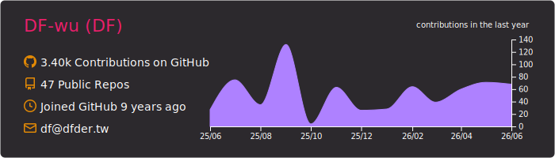
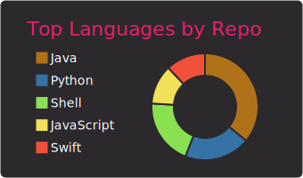
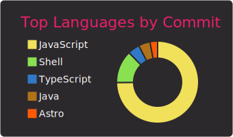
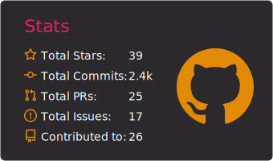
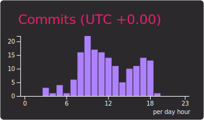

# DF Wu ｜ Backend Systems Engineer

我是一位偏後端與系統工程取向的開發者，長期專注在 **Microservices、Cloud-Native、DevOps 與工程自動化**。

我的工作方式是：先釐清限制與邊界，再把複雜系統拆成可演進、可維運、可觀測的交付節奏。  
I care about practical outcomes: reliability, maintainability, and team velocity.

---

## Engineering Snapshot

> Data snapshot: 2026-03-01

| Signal | Current |
| --- | --- |
| Public repositories | 123 |
| Owned repositories（non-fork） | 46 public + 16 private |
| Yearly contributions | 605 |
| Yearly commits | 567 |
| Merged pull requests | 22 |
| External merged PRs | 13 |
| Organizations | PDAS-team、SOSELAB |

---

## Focus Areas

- **Backend Engineering**：Java / Python / Go 服務設計、API 邊界治理、資料流程與穩定性。
- **Distributed Systems**：微服務拆分、整合、部署策略與故障隔離思維。
- **Cloud & Platform Delivery**：Docker 化交付、CI 流程整合、環境自動化。
- **Research-to-Implementation**：把研究與實驗轉成可落地、可驗證的工程方案。

---

## Organization & Collaboration

- **PDAS-team**：參與多服務協作場景（30 repos，含 29 private），涵蓋後端、平台與整體交付鏈路。
- **SOSELAB**：研究與工程交會的協作情境，強化技術探索與實作連結。
- **Cross-repo Contribution**：持續以 PR 形式在不同 repository 交付功能、修正與文件品質提升。

---

## Selected Projects

| Project | What it demonstrates | Stack |
| --- | --- | --- |
| [iDRACFanSpeedControl](https://github.com/DF-wu/iDRACFanSpeedControl) | 面向實務運維情境的伺服器風扇控制自動化 | Shell |
| [HideReplier](https://github.com/DF-wu/HideReplier) | 完整功能實作與後端邏輯整合的交付經驗 | Java |
| [myServices](https://github.com/DF-wu/myServices) | 自建服務組合與部署演進實驗場 | Python, Docker |
| [CCTS](https://github.com/DF-wu/CCTS) | 持續式後端架構演進練習 | Java |
| [df_dice](https://github.com/DF-wu/df_dice) | 輕量工具產品化與快速迭代 | JavaScript |
| [taobaoOrderExporter](https://github.com/DF-wu/taobaoOrderExporter) | 面向實際工作流程的資料匯出工具 | HTML, JavaScript |

---

## Recent External Merged PRs

- [`stanley2058/lilac-mono#5`](https://github.com/stanley2058/lilac-mono/pull/5) — cleanup and quality refinement.
- [`stanley2058/lilac-mono#4`](https://github.com/stanley2058/lilac-mono/pull/4) — custom Tavily API endpoint support.
- [`stanley2058/lilac-mono#1`](https://github.com/stanley2058/lilac-mono/pull/1) — Exa web search provider integration.
- [`Minidoracat/mcp-feedback-enhanced#138`](https://github.com/Minidoracat/mcp-feedback-enhanced/pull/138) — localization and docs enhancement.
- [`yym68686/ChatGPT-Telegram-Bot#111`](https://github.com/yym68686/ChatGPT-Telegram-Bot/pull/111) — markdown table correctness.
- [`is-a-dev/register#19293`](https://github.com/is-a-dev/register/pull/19293) — custom domain registration contribution.

---

## Core Stack

### Languages

### Platform & Infra

### Daily Environment

---

## GitHub Analytics

## Profile Summary Cards

## WakaTime

<!-- waka-box start -->
<!-- waka-box end -->

---

## Portfolio & Contact

- Resume: [CHUFEIWU_Resume.pdf](https://github.com/DF-wu/resume/blob/main/CHUFEIWU_Resume.pdf)
- Portfolio repo: [DF-wu/resume](https://github.com/DF-wu/resume)
- LinkedIn: [chufei-wu-b33990164](https://www.linkedin.com/in/chufei-wu-b33990164/)
- Mastodon: [@df@g0v.social](https://g0v.social/@df)

如果你正在尋找能把「技術複雜度」轉成「穩定交付」的工程夥伴，歡迎來聊。

---

## Acknowledgements

- Summary cards powered by [vn7n24fzkq/github-profile-summary-cards](https://github.com/vn7n24fzkq/github-profile-summary-cards)
