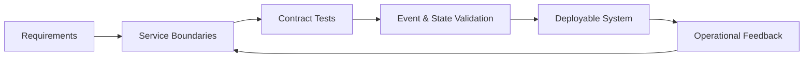

  

  <h1>ChuFei Wu · DF Wu</h1>

  

    <strong>Backend & Platform Engineer</strong> 
    Taipei, Taiwan · building backend systems that stay stable, maintainable, and deployable as complexity grows.
  

  

    
    
    
    
  

---

## Operating Signal

I focus on the work that still matters after the first deploy: clear service boundaries, predictable event flows, readable handoffs, and automation that keeps production boring.

| What I bring | Evidence |
| --- | --- |
| Backend architecture with reliability bias | CCTS research, event-driven microservice testing, Spring Boot systems |
| Platform habits | Docker services, Linux operations, Nginx/Jenkins workflows, home-lab ownership |
| Research-backed engineering | IEEE APSEC 2022 first author, IEEE ICS 2020 co-author, TCSE Best Chinese Paper |
| OSS collaboration | External PRs across integrations, docs correctness, localization, and cleanup |

```mermaid
flowchart LR
  A[Requirements] --> B[Service Boundaries]
  B --> C[Contract Tests]
  C --> D[Event & State Validation]
  D --> E[Deployable System]
  E --> F[Operational Feedback]
  F --> B
```

## Proof Points

| Signal | Snapshot |
| --- | ---: |
| Public repositories | 123 |
| Owned repositories | 46 public + 16 private |
| Yearly contributions | 605 |
| Yearly commits | 567 |
| Merged pull requests | 22 |
| External merged pull requests | 13 |
| IEEE publications | 2 |
| Total research publications | 5 |

## Selected Work

| Project | Why it matters | Stack |
| --- | --- | --- |
| [CCTS](https://github.com/DF-wu/CCTS) | Composite Contract Testing Service behind my APSEC 2022 paper; combines Pact consumer-driven contracts, event-log sequence checks, and SAGA-style state assertions. | Java, Spring Boot, RabbitMQ, MongoDB |
| [HideReplier](https://github.com/DF-wu/HideReplier) | Full lifecycle delivery with backend logic, workflow design, and deployment ownership. | Java |
| [myServices](https://github.com/DF-wu/myServices) | Docker-based home-lab infrastructure I operate and depend on daily. | Python, Docker |
| [iDRACFanSpeedControl](https://github.com/DF-wu/iDRACFanSpeedControl) | Server thermal automation that removes repetitive operations from daily life. | Shell |
| [BehaviorMonitor](https://github.com/DF-wu/BehaviorMonitor) | AI-assisted prototyping with production-quality engineering judgment underneath. | TypeScript |

## Research

| Publication | Venue | Role |
| --- | --- | --- |
| [Testing for Event-Driven Microservices Based on Consumer-Driven Contracts and State Models](https://ieeexplore.ieee.org/document/10043304/) | IEEE APSEC 2022 | First author · thesis work |
| [PDAS: A Digital-Signature-Based Authorization Platform for Digital Personal Data](https://ieeexplore.ieee.org/document/9359082/) | IEEE ICS 2020 | Co-author · PDAS-team core contributor |
| 事件驅動微服務系統之複合契約測試機制 | TCSE 2022 | Best Chinese Paper Award |
| 數位個人資料授權之計價與雙向支付平台之系統設計 | NCS 2021 | Co-author |
| 基於數位簽章之個資授權平台設計 | TCSE 2020 | Co-author |

## Technical Surface

  
  
  
  
  
  
  
  
  
  

| Domain | Tools and habits |
| --- | --- |
| Backend | Java, Spring Boot, Go, Gin, Python service work |
| Data & messaging | MySQL, MariaDB, MongoDB, SQLite, RabbitMQ |
| Infrastructure | Docker, Linux, Nginx, Jenkins, self-hosted services |
| Engineering practices | Microservices, event-driven design, consumer-driven contract testing, CI/CD |

## Open Source Trail

| PR | Repository | Contribution |
| --- | --- | --- |
| [#5](https://github.com/stanley2058/lilac-mono/pull/5) | `stanley2058/lilac-mono` | Cleanup and quality refinement |
| [#4](https://github.com/stanley2058/lilac-mono/pull/4) | `stanley2058/lilac-mono` | Custom Tavily API endpoint support |
| [#1](https://github.com/stanley2058/lilac-mono/pull/1) | `stanley2058/lilac-mono` | Exa web search provider integration |
| [#138](https://github.com/Minidoracat/mcp-feedback-enhanced/pull/138) | `Minidoracat/mcp-feedback-enhanced` | Traditional Chinese localization and docs enhancement |
| [#111](https://github.com/yym68686/ChatGPT-Telegram-Bot/pull/111) | `yym68686/ChatGPT-Telegram-Bot` | Documentation correctness fix |
| [#19293](https://github.com/is-a-dev/register/pull/19293) | `is-a-dev/register` | Custom domain registration contribution |

## Hiring Fit

| Role | Why I fit |
| --- | --- |
| Backend Engineer | Service delivery with maintainability, event-driven reasoning, and reliability focus. |
| Platform Engineer | Deployment-aware engineering, Linux/Docker operations, and automation habits. |
| Systems-oriented SWE | Practical architecture decisions under real constraints, backed by research and OSS collaboration. |

## Extended GitHub Evidence

  
  
  
  

<strong>More activity signals</strong>

 

## Contact

  <a href="mailto:df@dfder.tw">df@dfder.tw</a> ·
  <a href="https://df.is-a.dev">df.is-a.dev</a> ·
  <a href="https://github.com/DF-wu/resume/blob/main/CHUFEIWU_Resume.pdf">resume</a> ·
  <a href="https://www.linkedin.com/in/chufei-wu-b33990164/">LinkedIn</a>

---

Summary cards powered by <a href="https://github.com/vn7n24fzkq/github-profile-summary-cards">vn7n24fzkq/github-profile-summary-cards</a>.
