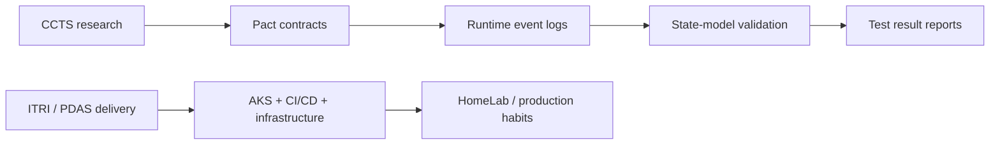

  

  <h1>吳朱飛 · ChuFei Wu · DF Wu</h1>

  

    <strong>Software Engineer · Service Developer · Backend / Platform Engineer</strong> 
    Taiwan · M.S. / B.S. in Computer Science and Engineering, National Taiwan Ocean University
  

  

    
    
    
    
  

---

## What To Know First

I am strongest where backend engineering meets operational reality: event-driven systems, microservices, deployment, CI/CD, data flow, and the question of whether a system can still be understood after it ships.

My portfolio has four proof lines:

| Proof line | Evidence |
| --- | --- |
| **SOSELab research training** | Service-oriented software engineering lab context: microservice testing, monitoring, retrieval/search, SOA, and chatbot application architecture |
| **Research that became software** | CCTS, an 8k+ LOC Spring Boot verification service for event-driven microservices; IEEE APSEC 2022; TCSE 2022 Best Chinese Paper |
| **Customer-delivered engineering** | ITRI / PDAS-team work on personal-data authorization and valuation/payment systems, including AKS delivery and CI/CD/infrastructure documentation |
| **Operations I personally live with** | HomeLab with 30+ services across storage, DNS, monitoring, media, albums, and home automation; iDRAC/IPMI server automation |
| **Public collaboration** | Merged PRs across search-provider integration, documentation correctness, localization, firmware build docs, and project cleanup |

```mermaid
flowchart LR
  Research[CCTS research] --> Contracts[Pact contracts]
  Contracts --> Events[Runtime event logs]
  Events --> States[State-model validation]
  States --> Reports[Test result reports]
  Delivery[ITRI / PDAS delivery] --> Infra[AKS + CI/CD + infrastructure]
  Infra --> Ops[HomeLab / production habits]
```

## Verified Snapshot

| Signal | Value |
| --- | ---: |
| GitHub public repositories | 127 |
| Non-fork repositories visible via GitHub search | 64 |
| Merged pull requests found via GitHub search | 23 |
| External merged pull requests found via GitHub search | 12 |
| IEEE publications | 2 |
| Total research publications listed | 5 |
| HomeLab services operated | 30+ |
| CCTS implementation size | 8k+ LOC |
| PDAS / payment platform implementation size | 40k+ LOC |

Snapshot refreshed from public GitHub API/search and public resume on 2026-06-07.

## Research And Publications

### SOSELab · Service-Oriented Software Engineering Laboratory

I did my graduate research in [SOSELab](https://soselab.cs.ntou.edu.tw/) at NTOU CSE, advised by [Prof. Shang-Pin Ma](https://soselab.cs.ntou.edu.tw/director/). The lab's public research directions include microservice testing, microservice monitoring, microservice retrieval/search, service-oriented architecture, and chatbot application architecture.

SOSELab's [postgraduates page](https://soselab.cs.ntou.edu.tw/lab-members/) lists my thesis record:
**事件驅動微服務系統之契約測試暨端到端測試研究** (2022/7).

SOSELab's [publications page](https://soselab.cs.ntou.edu.tw/publications/) also gives the cleanest public trail for my research line: APSEC 2022 CCTS, TCSE 2022 Best Chinese Paper, NCS 2021 personal-data valuation/payment, and ICS 2020 PDAS.

### CCTS · Composite Contract Testing Service

[CCTS](https://github.com/DF-wu/CCTS) is my thesis system for testing event-driven microservice behavior. It combines consumer-driven contracts, event-log sequence validation, and state-machine based flow assertions so teams can verify not only message contracts, but also whether real execution follows the expected service path.

| Work | Venue | Role |
| --- | --- | --- |
| [Testing for Event-Driven Microservices Based on Consumer-Driven Contracts and State Models](https://ieeexplore.ieee.org/document/10043304/) | IEEE APSEC 2022 | First author · thesis work |
| 事件驅動微服務系統之複合契約測試機制 | TCSE 2022 | Best Chinese Paper Award |

Related proof-of-concept services:
[orchestrator](https://github.com/DF-wu/CCTS_poc_orchestrator) ·
[payment](https://github.com/DF-wu/CCTS_poc_payment) ·
[points](https://github.com/DF-wu/CCTS_poc_points) ·
[logging](https://github.com/DF-wu/CCTS_poc_logging)

### PDAS · Personal Data Authorization / Valuation / Payment

At ITRI / PDAS-team, I worked on personal-data authorization and valuation/payment systems. My contribution areas included logging, payment, blockchain, third-party fintech integration, CI/CD, infrastructure, and delivery documentation, with deployment to Azure Kubernetes Service.

| Work | Venue | Role |
| --- | --- | --- |
| [PDAS: A Digital-Signature-Based Authorization Platform for Digital Personal Data](https://ieeexplore.ieee.org/document/9359082/) | IEEE ICS 2020 | Co-author · PDAS-team contributor |
| 數位個人資料授權之計價與雙向支付平台之系統設計 | NCS 2021 | Co-author |
| 基於數位簽章之個資授權平台設計 | TCSE 2020 | Co-author |

## Selected Engineering Work

| Project | What it proves | Stack / context |
| --- | --- | --- |
| [CCTS](https://github.com/DF-wu/CCTS) | Research-grade backend system design for event-driven microservice testing. | Java, Spring Boot, RabbitMQ, MongoDB, Pact |
| [HideReplier](https://github.com/DF-wu/HideReplier) | End-to-end side-project ownership: anonymous Discord reply bot, build chain, Docker image, Fly.io migration. | Java, Spring Boot, Docker |
| [myServices](https://github.com/DF-wu/myServices) | Real operating environment, not a portfolio simulation: service composition, storage/network notes, MariaDB backup, Docker and server maintenance. | Docker, Linux, NAS, MariaDB, SDN |
| [iDRACFanSpeedControl](https://github.com/DF-wu/iDRACFanSpeedControl) | Server operations automation with iDRAC/IPMI, ESXi temperature inputs, GPU-aware logic, Docker deployment, and explicit limitation auditing. | Shell, Docker, IPMI, ESXi, NVIDIA |
| [BehaviorMonitor](https://github.com/DF-wu/BehaviorMonitor) | Full-stack AI-assisted implementation with real-time UI, admin panel, analytics, logs, Firebase backend, and GitHub Pages deployment. | React 19, TypeScript, Firebase |
| [urlbalancer](https://github.com/DF-wu/urlbalancer) | Go + React practice around control-plane/data-plane separation and reverse-proxy service logic. | Go, Gin, React, SQLite |

## Experience

| Context | Period | What I did |
| --- | --- | --- |
| **SOSELAB, NTOU CSE** | 2020 - 2022 | Designed and implemented CCTS; published at IEEE APSEC 2022; won TCSE 2022 Best Chinese Paper. |
| **Industrial Technology Research Institute (ITRI)** | Jul 2021 - Dec 2021 | Built personal-data authorization and valuation/payment systems across microservices, event-driven architecture, CI/CD, security, blockchain, fintech, AKS deployment, and delivery docs. |
| **Ming-Chyuan Ltd.** | Jul 2012 - present | Maintains and modernizes internal digital systems for CNC manufacturing workflows, moving legacy systems toward more reliable architecture. |
| **National Taiwan Ocean University** | Teaching Assistant | Helped migrate course content into a newer content-management workflow and supported lesson design/customization. |
| **Public OSS / g0v.social** | Ongoing | Contributes fixes, integrations, localization, and documentation improvements to public projects. |

## Technical Surface

  
  
  
  
  
  
  
  
  
  
  
  

| Domain | Tools and habits |
| --- | --- |
| Backend | Java, Spring Boot, Go/Gin, Python/Django, Node.js/Express |
| Data & messaging | MongoDB, MariaDB, MySQL, Redis, PostgreSQL, SQLite, RabbitMQ, Kafka |
| Platform | Docker, Linux, Nginx, Jenkins, Kubernetes, AKS, ESXi, Unraid, TrueNAS |
| SQA / delivery | Pact, JUnit, Postman, SideeX, Insomnia, CI/CD, customer-facing documentation |
| Systems | Microservices, event-driven design, contract testing, home-lab operations, network/storage management |

## Open Source Trail

| PR | Repository | Contribution pattern |
| --- | --- | --- |
| [#1](https://github.com/stanley2058/lilac-mono/pull/1) | `stanley2058/lilac-mono` | Added Exa web search provider and tests |
| [#4](https://github.com/stanley2058/lilac-mono/pull/4) | `stanley2058/lilac-mono` | Added custom Tavily API endpoint support |
| [#5](https://github.com/stanley2058/lilac-mono/pull/5) | `stanley2058/lilac-mono` | Cleanup and documentation follow-up |
| [#138](https://github.com/Minidoracat/mcp-feedback-enhanced/pull/138) | `Minidoracat/mcp-feedback-enhanced` | Traditional Chinese localization and docs enhancement |
| [#111](https://github.com/yym68686/ChatGPT-Telegram-Bot/pull/111) | `yym68686/ChatGPT-Telegram-Bot` | Markdown table correctness fix |
| [#691](https://github.com/flipperdevices/flipperzero-firmware/pull/691) | `flipperdevices/flipperzero-firmware` | Corrected firmware build documentation command |
| [#167](https://github.com/SrinivasanTarget/ContractTestingBoilerplate/pull/167) | `SrinivasanTarget/ContractTestingBoilerplate` | Corrected Pact broker port mismatch |
| [#19293](https://github.com/is-a-dev/register/pull/19293) | `is-a-dev/register` | Custom domain registration contribution |

## Role Fit

| Role | Why this background fits |
| --- | --- |
| **Backend Engineer** | CCTS, PDAS, HideReplier, and URL Balancer show service design across APIs, messaging, persistence, event flows, and deployment. |
| **Platform Engineer** | HomeLab, AKS delivery, Docker/Linux/NAS operations, and iDRAC automation show day-two thinking, not only code writing. |
| **Systems-oriented SWE** | SOSELAB research, ITRI delivery, internal systems maintenance, and OSS work show practical architecture under constraints. |

## Extended GitHub Evidence

  
  
  
  

<strong>More activity signals</strong>

 

## Source Links

- [Resume PDF](https://github.com/DF-wu/resume/blob/main/CHUFEIWU_Resume.pdf)
- [Live profile page](https://df.is-a.dev)
- [SOSELab website](https://soselab.cs.ntou.edu.tw/)
- [SOSELab postgraduates](https://soselab.cs.ntou.edu.tw/lab-members/)
- [SOSELab publications](https://soselab.cs.ntou.edu.tw/publications/)
- [CCTS repository](https://github.com/DF-wu/CCTS)
- [IEEE APSEC 2022 paper](https://ieeexplore.ieee.org/document/10043304/)
- [IEEE ICS 2020 paper](https://ieeexplore.ieee.org/document/9359082/)

## Contact

  <a href="mailto:df@dfder.tw">df@dfder.tw</a> ·
  <a href="https://df.is-a.dev">df.is-a.dev</a> ·
  <a href="https://github.com/DF-wu/resume/blob/main/CHUFEIWU_Resume.pdf">resume</a> ·
  <a href="https://www.linkedin.com/in/chufei-wu-b33990164/">LinkedIn</a>

---

Summary cards powered by <a href="https://github.com/vn7n24fzkq/github-profile-summary-cards">vn7n24fzkq/github-profile-summary-cards</a>.
