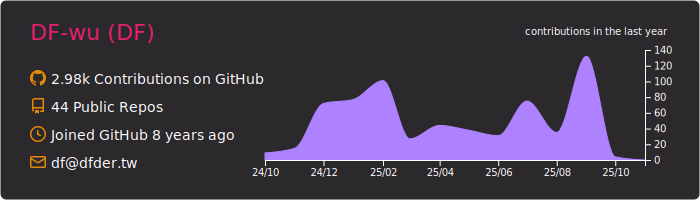
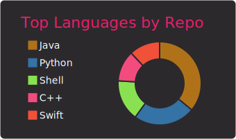
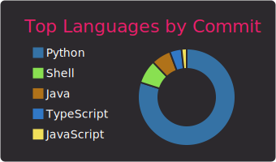

# My profile page
Not-Full-Enough-Stack developer with a passion for scalable system architecture and emerging technologies. 
Experienced in building cloud-native applications and microservices, with a strong focus on backend development using Java, Python and Golang.
Let's push the boundaries of what technology can achieve! 🚀

## Table of Contents
- [My profile page](#my-profile-page)
  - [Table of Contents](#table-of-contents)
  - [repo status (private repo excluded)](#repo-status-private-repo-excluded)
  - [Professional Connections](#professional-connections)
  - [Professional Portfolio \& Resume](#professional-portfolio--resume)
  - [Monokai Style Charts](#monokai-style-charts)
  - [wakatime analysis](#wakatime-analysis)
  - [Additional Information](#additional-information)
  - [Achievements](#achievements)

 

## repo status (private repo excluded)
 

## Professional Connections

>)

[![](https://img.shields.io/badge/-HackMD-333333?style=flat-square&logo=data%3Aimage%2Fsvg%2Bxml%3Bbase64%2CPD94bWwgdmVyc2lvbj0iMS4wIiBlbmNvZGluZz0iVVRGLTgiIHN0YW5kYWxvbmU9Im5vIj8%2BCjxzdmcKICAgd2lkdGg9IjE3OTIiCiAgIGhlaWdodD0iMTc5MiIKICAgdmlld0JveD0iMCAwIDE3OTIgMTc5MiIKICAgdmVyc2lvbj0iMS4xIgogICBpZD0ic3ZnNCIKICAgc29kaXBvZGk6ZG9jbmFtZT0iZmlsZS10ZXh0Mi5zdmciCiAgIGlua3NjYXBlOnZlcnNpb249IjEuMSAoYzRlOGY5ZWQ3NCwgMjAyMS0wNS0yNCkiCiAgIHhtbG5zOmlua3NjYXBlPSJodHRwOi8vd3d3Lmlua3NjYXBlLm9yZy9uYW1lc3BhY2VzL2lua3NjYXBlIgogICB4bWxuczpzb2RpcG9kaT0iaHR0cDovL3NvZGlwb2RpLnNvdXJjZWZvcmdlLm5ldC9EVEQvc29kaXBvZGktMC5kdGQiCiAgIHhtbG5zPSJodHRwOi8vd3d3LnczLm9yZy8yMDAwL3N2ZyIKICAgeG1sbnM6c3ZnPSJodHRwOi8vd3d3LnczLm9yZyI%2BCiAgPGRlZnMKICAgICBpZD0iZGVmczgiIC8%2BCiAgPHNvZGlwb2RpOm5hbWVkdmlldwogICAgIGlkPSJuYW1lZHZpZXc2IgogICAgIHBhZ2Vjb2xvcj0iI2ZmZmZmZiIKICAgICBib3JkZXJjb2xvcj0iIzY2NjY2NiIKICAgICBib3JkZXJvcGFjaXR5PSIxLjAiCiAgICAgaW5rc2NhcGU6cGFnZXNoYWRvdz0iMiIKICAgICBpbmtzY2FwZTpwYWdlb3BhY2l0eT0iMC4wIgogICAgIGlua3NjYXBlOnBhZ2VjaGVja2VyYm9hcmQ9IjAiCiAgICAgc2hvd2dyaWQ9ImZhbHNlIgogICAgIGlua3NjYXBlOnpvb209IjAuNDU4NzA1MzYiCiAgICAgaW5rc2NhcGU6Y3g9IjkwMS40NTAxMiIKICAgICBpbmtzY2FwZTpjeT0iODk5LjI3MDA3IgogICAgIGlua3NjYXBlOndpbmRvdy13aWR0aD0iMjU1MiIKICAgICBpbmtzY2FwZTp3aW5kb3ctaGVpZ2h0PSIxMzcxIgogICAgIGlua3NjYXBlOndpbmRvdy14PSIyNTYwIgogICAgIGlua3NjYXBlOndpbmRvdy15PSIzMCIKICAgICBpbmtzY2FwZTp3aW5kb3ctbWF4aW1pemVkPSIwIgogICAgIGlua3NjYXBlOmN1cnJlbnQtbGF5ZXI9InN2ZzQiIC8%2BCiAgPHBhdGgKICAgICBkPSJNMTU5NiA0NzZxMTQgMTQgMjggMzZoLTQ3MnYtNDcycTIyIDE0IDM2IDI4em0tNDc2IDE2NGg1NDR2MTA1NnEwIDQwLTI4IDY4dC02OCAyOGgtMTM0NHEtNDAgMC02OC0yOHQtMjgtNjh2LTE2MDBxMC00MCAyOC02OHQ2OC0yOGg4MDB2NTQ0cTAgNDAgMjggNjh0NjggMjh6bTE2MCA3MzZ2LTY0cTAtMTQtOS0yM3QtMjMtOWgtNzA0cS0xNCAwLTIzIDl0LTkgMjN2NjRxMCAxNCA5IDIzdDIzIDloNzA0cTE0IDAgMjMtOXQ5LTIzem0wLTI1NnYtNjRxMC0xNC05LTIzdC0yMy05aC03MDRxLTE0IDAtMjMgOXQtOSAyM3Y2NHEwIDE0IDkgMjN0MjMgOWg3MDRxMTQgMCAyMy05dDktMjN6bTAtMjU2di02NHEwLTE0LTktMjN0LTIzLTloLTcwNHEtMTQgMC0yMyA5dC05IDIzdjY0cTAgMTQgOSAyM3QyMyA5aDcwNHExNCAwIDIzLTl0OS0yM3oiCiAgICAgaWQ9InBhdGgyIgogICAgIHN0eWxlPSJmaWxsOiNmZmZmZmYiIC8%2BCjwvc3ZnPgo%3D&logoColor=ffffff)](https://hackmd.io/)

## Professional Portfolio & Resume

  

> 🎯 Specialized in backend development and system architecture design, excelling at solving complex technical challenges
> 
> 💼 Click above to view my complete resume and portfolio

## Monokai Style Charts

## wakatime analysis

<figure><embed src="https://wakatime.com/share/@cb2e708b-89d1-4093-bf95-cafd34987f43/d210fe3c-7b63-47b5-a4d4-b70bb8300fcb.svg"></embed></figure>

<!-- png version -->
<!-- ](https://www.linkedin.com/in/chufei-wu-b33990164/) -->

<!-- Example:  -->

 <!-- waka-box start -->
 <!-- waka-box end -->
 
## Additional Information
Thank you for visiting my profile! Feel free to reach out through the links above for collaboration opportunities. Let's create something amazing together!

[More Info about the template author](https://github.com/vn7n24fzkq/github-profile-summary-cards)

## Achievements
> Summarized from the resume and page image:
> - Published relevant technical papers at international conferences
> - Executed large-scale cloud projects and multiple microservices architecture designs
