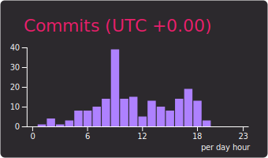

>)

<!-- <figure><embed src="https://wakatime.com/share/@cb2e708b-89d1-4093-bf95-cafd34987f43/084d2c44-1ff2-4765-86e4-efed21fe9861.svg"></embed></figure> -->
](https://www.linkedin.com/in/chufei-wu-b33990164/)

<!-- Example:  -->

 <!-- waka-box start -->
 <!-- waka-box end -->
 
 
[More Info about the template author](https://github.com/vn7n24fzkq/github-profile-summary-cards)
