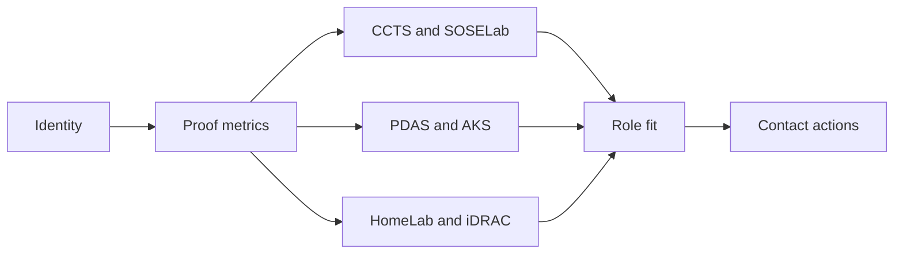

# 01 Noir Systems Dossier

## Design Philosophy

Noir is the executive dossier: dark, precise, and evidence-heavy. It is built for hiring managers or senior engineers who want signal density over presentation gloss. The design centers research evidence, shipped systems, and operations maturity in one continuous proof path.

## Technical File Map

| Layer | File / Branch | Responsibility |
| --- | --- | --- |
| Branch | `portfolio/noir` | Sets `DEFAULT_STYLE = 'noir'` |
| Component | `site/src/components/NoirPortfolio.astro` | Dense dossier page and evidence modules |
| Stylesheet | `site/public/styles/noir.css` | Dark grid, brass/cyan accents, sticky navigation |
| Shared intelligence | `PortfolioIntelligence.astro` | APIs, charts, insights, command search |

## Functional Scope

| Feature | Implementation |
| --- | --- |
| Proof metrics | CCTS, PDAS, home-lab, repositories |
| Evidence sections | Lab, research, work, stack, OSS, role fit |
| APIs | Static JSON endpoints and OpenAPI inventory |
| Effects | Reading progress, command palette, API console, reveal states |
| External API | Progressive GitHub public profile fetch |

## Architecture Diagram

## Design System

- Palette: black, brass, cyan, green, red.
- Typography: IBM Plex Sans plus Azeret Mono for operational labels.
- Layout: full-width bands, sharp 8px cards, high contrast.
- Content density: highest among the ten variants.

## Verification Checklist

- `PORTFOLIO_STYLE=noir npm run build`
- H1 renders as `ChuFei Wu`.
- Avatar loads.
- Command palette finds projects and APIs.
- API console can preview `/api/profile.json`.
