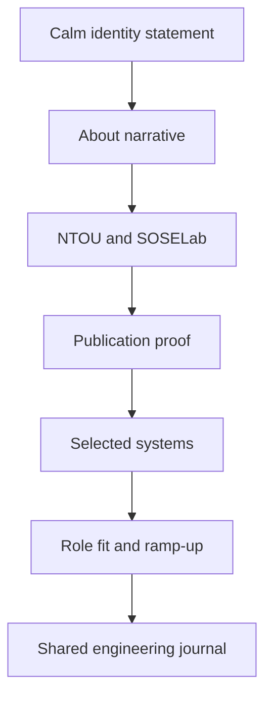

# 02 Linen Editorial Portfolio

## Design Philosophy

Linen is the quiet editorial portfolio. It makes maintainability and long-term engineering judgment feel readable, calm, and human. It is intended for readers who want to understand the person behind the systems before scanning every technical proof point.

## Technical File Map

| Layer | File / Branch | Responsibility |
| --- | --- | --- |
| Branch | `portfolio/linen` | Sets `DEFAULT_STYLE = 'linen'` |
| Component | `site/src/components/LinenPortfolio.astro` | Editorial sections, publications, experience, fit |
| Stylesheet | `site/public/styles/linen.css` | Light paper tone, serif headings, soft proof cards |
| Shared intelligence | `PortfolioIntelligence.astro` | Blog-grade essays and API layer |

## Functional Scope

| Feature | Implementation |
| --- | --- |
| Editorial identity | Hero thesis plus portrait module |
| Research details | IEEE and domestic publication cards |
| Blog layer | Shared insight cards and JSON feed |
| APIs | `/api/feed.json`, `/api/insights.json`, `/api/search.json` |
| Effects | Search, filters, contrast toggle, progress bar |

## Reading Flow

## Design System

- Palette: paper, graphite, pine, cobalt.
- Typography: Playfair Display for editorial authority, Inter for scanning.
- Layout: single-column reading rhythm with two-column project grids.
- Cards stay at 8px radius to avoid soft marketing styling.

## Verification Checklist

- `PORTFOLIO_STYLE=linen npm run build`
- No body text below 16px on mobile-critical reading sections.
- Insight filters work in shared journal section.
- JSON feed endpoint returns valid JSON.
