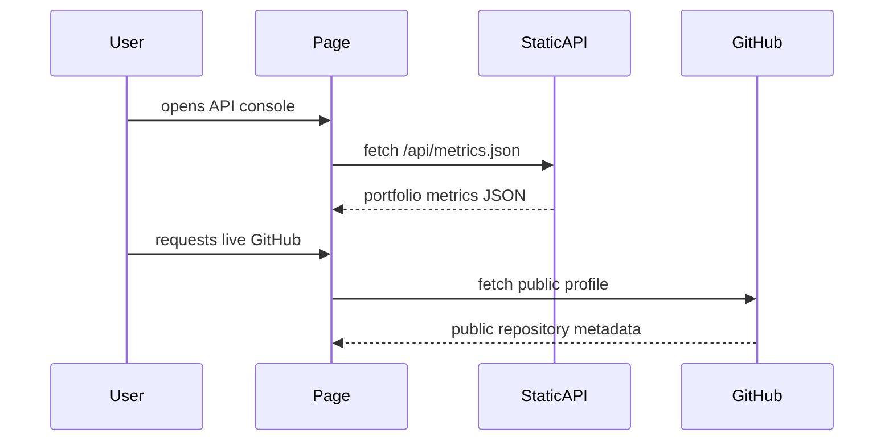

# 03 Glass Runtime Surface

## Design Philosophy

Glass is a runtime surface: translucent, layered, and status-oriented. It is for viewers who respond to dashboards, live systems, and technical environments. The design keeps the glass effect purposeful by framing runtime evidence and API exploration.

## Technical File Map

| Layer | File / Branch | Responsibility |
| --- | --- | --- |
| Branch | `portfolio/glass` | Sets `DEFAULT_STYLE = 'glass'` |
| Component | `site/src/components/GlassPortfolio.astro` | Glass cards for metrics, projects, publications |
| Stylesheet | `site/public/styles/glass.css` | Dark glass panels, blue/amber contrast |
| Shared intelligence | `PortfolioIntelligence.astro` | API console and live GitHub preview |

## Functional Scope

| Feature | Implementation |
| --- | --- |
| Runtime feel | Glass panels and status-like cards |
| Live data | API console and GitHub public fetch |
| Evidence | Publications, projects, OSS, role fit |
| Charts | Shared impact bars and timeline |
| Search | Command palette over pages, APIs, insights, styles |

## Runtime Data Flow

## Design System

- Palette: charcoal, blue, amber, translucent white.
- Typography: Inter for high readability, mono labels for status.
- Effects: blur is used for panel depth, not random decoration.
- Accessibility: all glass panels retain readable foreground contrast.

## Verification Checklist

- `PORTFOLIO_STYLE=glass npm run build`
- API console opens and previews static endpoints.
- Portrait card loads.
- No horizontal overflow at 390px width.
