# DF Wu

**Backend & Platform Engineer** &nbsp;·&nbsp; Taipei, Taiwan

Building backend systems that stay stable, maintainable, and deployable as complexity grows.

 

&nbsp;
&nbsp;
&nbsp;
&nbsp;

---

## Overview

&nbsp;

| Repos | Owned | Contributions/yr | Commits/yr | Merged PRs | External |
|:---:|:---:|:---:|:---:|:---:|:---:|
| **123** | **46** + 16 | **605** | **567** | **22** | **13** |

---

## Stack

**Languages**&nbsp;&nbsp;&nbsp;

**Infra**&nbsp;&nbsp;&nbsp;

---

## Featured Projects

&nbsp;

&nbsp;

| Project | What I Learned |
|:---|:---|
| **HideReplier** | What end-to-end delivery actually looks like when you own the whole loop |
| **CCTS** | How to tell if architecture decisions survive iteration |
| **myServices** | The difference between "deployment-oriented" and "actually getting paged" |
| **iDRACFanSpeedControl** | The best automation is the kind you forget exists |
| **BehaviorMonitor** | AI works best when you treat it as a tool, not a destination |

---

## Open Source

<table>
<tr>
<td align="center" width="33%">

**Cleanup**

[`lilac-mono #5`](https://github.com/stanley2058/lilac-mono/pull/5)
 quality refinement

</td>
<td align="center" width="33%">

**Integration**

[`lilac-mono #4`](https://github.com/stanley2058/lilac-mono/pull/4) · [`#1`](https://github.com/stanley2058/lilac-mono/pull/1)
 Tavily endpoint · Exa search

</td>
<td align="center" width="33%">

**Correctness**

[`mcp-feedback #138`](https://github.com/Minidoracat/mcp-feedback-enhanced/pull/138) · [`ChatGPT-Bot #111`](https://github.com/yym68686/ChatGPT-Telegram-Bot/pull/111)
 localization · doc fix

</td>
</tr>
</table>

---

## Language Breakdown

---

## Role Fit

| Role | Why | Evidence |
|:---|:---|:---|
| **Backend Engineer** | I design services for maintainability and runtime safety | HideReplier, CCTS |
| **Platform Engineer** | I think about deployment and operations from day one | myServices, iDRACFanSpeedControl |
| **Systems SWE** | I make practical architecture decisions under real constraints | OSS contributions, PDAS-team, SOSELAB |

---

## How I Ramp Up

```mermaid
gantt
    title First 90 Days
    dateFormat X
    axisFormat %s days
    section Survey
    Map architecture, find friction points     :0, 30
    section Reinforce
    Targeted improvements, reduce delivery friction :30, 60
    section Ship
    Measurable reliability and stability gains      :60, 90
```

---

<strong>Full Analytics</strong>

 

---

**Teams that value stable systems over fast demos — [let's talk](https://www.linkedin.com/in/chufei-wu-b33990164/).**

Profile cards: <a href="https://github.com/vn7n24fzkq/github-profile-summary-cards">github-profile-summary-cards</a>

