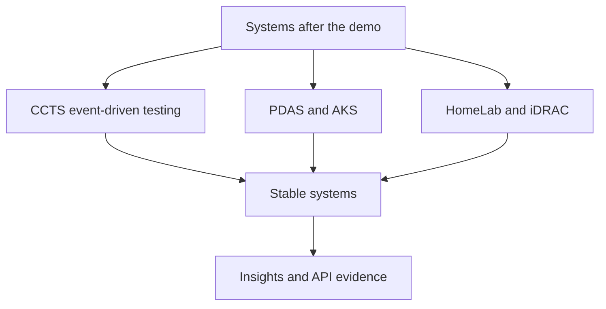

# 05 Dusk Reliability Narrative

## Design Philosophy

Dusk is a dark reliability narrative. It keeps the page cinematic enough to feel memorable while staying grounded in systems proof: event-driven testing, deployment work, operations, and collaboration patterns.

## Technical File Map

| Layer | File / Branch | Responsibility |
| --- | --- | --- |
| Branch | `portfolio/dusk` | Sets `DEFAULT_STYLE = 'dusk'` |
| Component | `site/src/components/DuskPortfolio.astro` | Narrative dark portfolio |
| Stylesheet | `site/public/styles/dusk.css` | Dark green/amber surface, subtle line effects |
| Shared intelligence | `PortfolioIntelligence.astro` | Shared charts, APIs, insights |

## Functional Scope

| Feature | Implementation |
| --- | --- |
| Narrative proof | About, papers, awards, projects, OSS |
| Motion | Subtle shared reveal and reading progress |
| API layer | Static endpoints plus API drawer |
| Blog layer | Engineering journal cards |
| Accessibility | Reduced-motion support and visible focus states |

## Reliability Storyline

## Design System

- Palette: black green, teal, amber, warm neutral.
- Typography: Inter for body, mono labels for evidence.
- Layout: centered hero, divided proof sections, dense cards.
- Effects: line-based depth and gradients tied to section structure.

## Verification Checklist

- `PORTFOLIO_STYLE=dusk npm run build`
- Hero portrait loads.
- Shared insight filters work.
- No console errors except dev-server connection logs.
