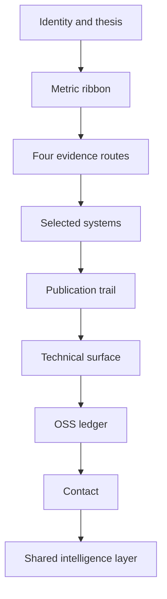

# 06 Atlas Evidence Map

## Design Philosophy

Atlas presents ChuFei Wu as a systems engineer understood through routes: research, delivery, operations, and collaboration. The page behaves like an evidence map rather than a resume, so visitors can see why the same person is credible for backend, platform, and systems-oriented work.

## Technical File Map

| Layer | File / Branch | Responsibility |
| --- | --- | --- |
| Branch | `portfolio/atlas` | Sets `DEFAULT_STYLE = 'atlas'` |
| Component | `site/src/components/AtlasPortfolio.astro` | Route map, proof rows, research stack, technical matrix |
| Stylesheet | `site/public/styles/atlas.css` | Paper grid, editorial type, hard evidence bands |
| Shared intelligence | `PortfolioIntelligence.astro` | APIs, charts, insight cards, live enhancement |

## Functional Scope

| Feature | Implementation |
| --- | --- |
| Evidence routes | Research / delivery / operations / collaboration route cards |
| Visual asset | GitHub avatar as identity proof panel |
| Charts | Shared impact chart plus metric ribbon |
| APIs | `/api/profile.json`, `/api/metrics.json`, `/api/styles.json`, `/api/search.json` |
| Interaction | Command palette, API console, reading progress, contrast toggle |

## Information Architecture

## Design System

- Palette: paper, ink, cobalt, pine, brass, coral.
- Typography: Playfair Display for editorial identity, Inter for body, Azeret Mono for route metadata.
- Layout: map-grid background, 8px cards, visible dividers, strong metric bands.
- Motion: no layout-changing animation; shared reveal and progress effects only.

## Verification Checklist

- One H1 and sequential section headings.
- Avatar has descriptive alt text.
- Touch targets meet 44px minimum in nav and action links.
- Desktop and mobile builds must pass no-horizontal-overflow checks.
