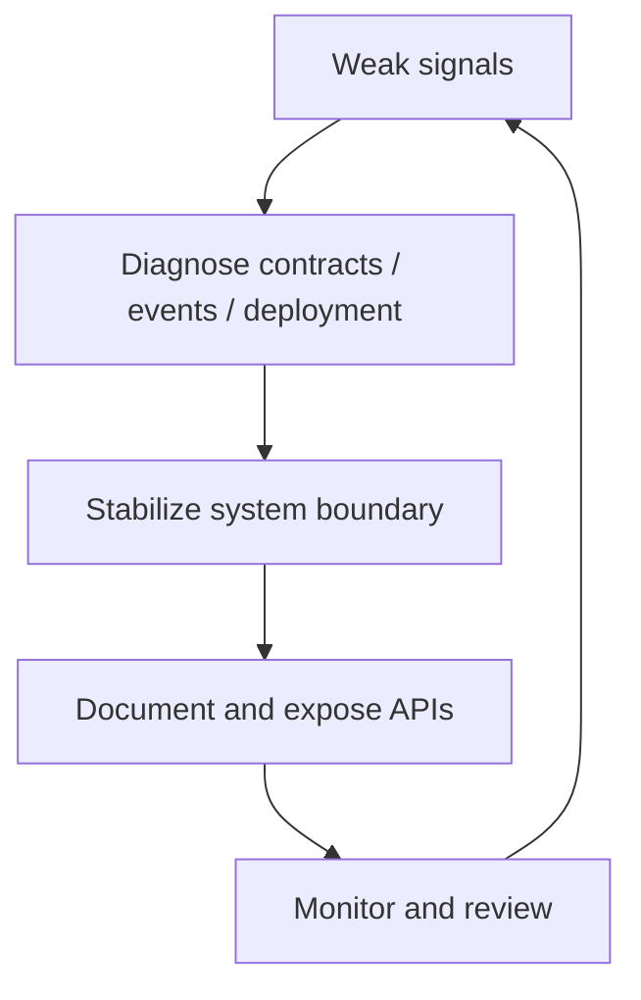

# 07 Signal Operations Desk

## Design Philosophy

Signal is the operations desk. It frames ChuFei Wu as someone who catches weak signals before they become incidents: missing contracts, unclear event flow, undocumented deployment paths, brittle server assumptions, and team friction around architecture.

## Technical File Map

| Layer | File / Branch | Responsibility |
| --- | --- | --- |
| Branch | `portfolio/signal` | Sets `DEFAULT_STYLE = 'signal'` |
| Component | `site/src/components/SignalPortfolio.astro` | Operations dashboard narrative |
| Stylesheet | `site/public/styles/signal.css` | Dark signal board, KPI strips, event feed |
| Shared intelligence | `PortfolioIntelligence.astro` | APIs, charts, command search, insights |

## Functional Scope

| Feature | Implementation |
| --- | --- |
| Signal board | Impact scores rendered as CSS bars |
| Incident memory | Timeline as operational context |
| Briefings | Insight articles presented as operations notes |
| Live API | GitHub public fetch in shared API console |
| Internal APIs | Metrics, search, styles, OpenAPI endpoints |

## Operations Diagram

## Design System

- Palette: graphite, teal, amber, off-white, red.
- Typography: IBM Plex Sans and Azeret Mono.
- Layout: hero plus operator card, KPI strip, signal grid, event feed.
- Effects: status bars and shared API/command tools.

## Verification Checklist

- `PORTFOLIO_STYLE=signal npm run build`
- Signal bars render with values.
- Live GitHub button handles success and failure.
- Mobile view stacks KPI strip without overflow.
