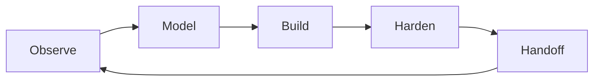

# 08 Forge Engineering Workshop

## Design Philosophy

Forge is the workshop. It emphasizes craft, iteration, and the path from uncertain requirements to stable systems. The page makes backend/platform work feel like a controlled build process rather than a list of tools.

## Technical File Map

| Layer | File / Branch | Responsibility |
| --- | --- | --- |
| Branch | `portfolio/forge` | Sets `DEFAULT_STYLE = 'forge'` |
| Component | `site/src/components/ForgePortfolio.astro` | Workshop narrative, project bench, pipeline |
| Stylesheet | `site/public/styles/forge.css` | Steel/rust light interface and build-grid layout |
| Shared intelligence | `PortfolioIntelligence.astro` | API catalog, articles, charts |

## Functional Scope

| Feature | Implementation |
| --- | --- |
| Workbench | Project cards grouped by proof value |
| Build pipeline | Observe / model / build / harden diagram |
| Shop notes | Capability matrix and insight cards |
| APIs | Projects, profile, metrics, styles, feed |
| Effects | Hover states, command palette, reading progress |

## Build Pipeline

## Design System

- Palette: steel, rust, cobalt, green, paper.
- Typography: IBM Plex Sans with mono labels.
- Layout: workshop bench, pipeline cards, material history.
- Motion: small hover and progress effects only.

## Verification Checklist

- `PORTFOLIO_STYLE=forge npm run build`
- Project bench links are reachable.
- Pipeline cards stack on mobile.
- `/api/projects.json` previews in API console.
