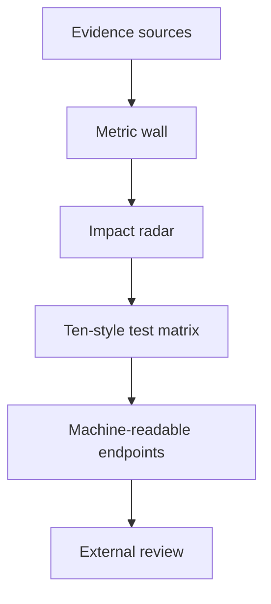

# 09 Observatory Analytics Lab

## Design Philosophy

Observatory is the analytics lab. It treats the portfolio as a measurable system: repository count, publications, LOC proof, services operated, branch variants, APIs, and source links become a data room.

## Technical File Map

| Layer | File / Branch | Responsibility |
| --- | --- | --- |
| Branch | `portfolio/observatory` | Sets `DEFAULT_STYLE = 'observatory'` |
| Component | `site/src/components/ObservatoryPortfolio.astro` | Metric wall, radar chart, source ledger |
| Stylesheet | `site/public/styles/observatory.css` | Dark analytics lab and dense grids |
| Shared intelligence | `PortfolioIntelligence.astro` | Shared charts, APIs, command tools |

## Functional Scope

| Feature | Implementation |
| --- | --- |
| Metric wall | Six high-signal counters |
| Radar chart | CSS score tiles from impact signals |
| Source ledger | Evidence sources and API catalog |
| Variant matrix | Ten branch design variants |
| APIs | Metrics, styles, OpenAPI, search |

## Data Room Flow

## Design System

- Palette: carbon, mint, gold, magenta, ivory.
- Typography: Inter with mono metadata.
- Layout: source-ledger grids and metric walls.
- Accessibility: charts include text labels and do not rely on color alone.

## Verification Checklist

- `PORTFOLIO_STYLE=observatory npm run build`
- Metric wall fits desktop and mobile.
- Source links wrap long URLs.
- `/api/styles.json` lists ten variants.
