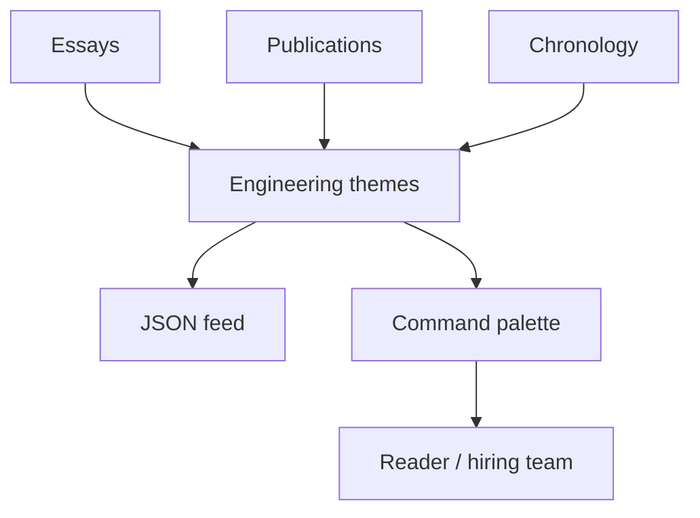

# 10 Archive Knowledge Journal

## Design Philosophy

Archive is the premium blog and knowledge journal. It turns the portfolio into a reading experience: essays, publications, chronology, JSON feed, and long-form proof for teams that value clear systems and clear writing.

## Technical File Map

| Layer | File / Branch | Responsibility |
| --- | --- | --- |
| Branch | `portfolio/archive` | Sets `DEFAULT_STYLE = 'archive'` |
| Component | `site/src/components/ArchivePortfolio.astro` | Essays, paper shelf, chronology |
| Stylesheet | `site/public/styles/archive.css` | Editorial archive surface |
| Shared intelligence | `PortfolioIntelligence.astro` | API/feed/search/insight enrichment |

## Functional Scope

| Feature | Implementation |
| --- | --- |
| Featured essays | Insight cards with tags and reading time |
| Publication shelf | IEEE and domestic conference records |
| Chronology | Timeline of professional context |
| Feed | `/api/feed.json` JSON Feed output |
| Search | Command palette over essays, papers, APIs, projects |

## Editorial Graph

## Design System

- Palette: ivory, ink, olive, rose, cobalt.
- Typography: Playfair Display for long-form editorial authority, IBM Plex Sans for body.
- Layout: feature essay grid, paper shelf, chronology index.
- Effects: reading progress and filters support blog-style navigation.

## Verification Checklist

- `PORTFOLIO_STYLE=archive npm run build`
- JSON feed link resolves.
- Essay cards retain readable line length.
- Mobile view keeps feature card from spanning awkwardly.
