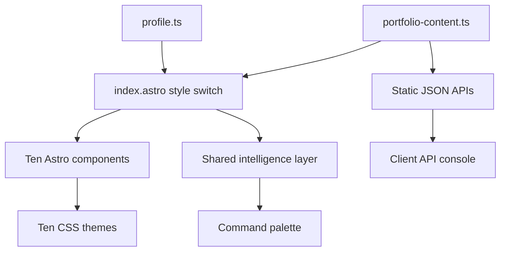

# DF Wu Portfolio Design System

This folder documents the ten branch-based portfolio variants.

| # | Variant | Branch | Component | Core intent |
| --- | --- | --- | --- | --- |
| 01 | Noir Systems Dossier | `portfolio/noir` | `NoirPortfolio.astro` | Dark proof dossier |
| 02 | Linen Editorial Portfolio | `portfolio/linen` | `LinenPortfolio.astro` | Quiet editorial resume |
| 03 | Glass Runtime Surface | `portfolio/glass` | `GlassPortfolio.astro` | Runtime dashboard feel |
| 04 | Ink Specification Sheet | `portfolio/ink` | `InkPortfolio.astro` | Hard technical specification |
| 05 | Dusk Reliability Narrative | `portfolio/dusk` | `DuskPortfolio.astro` | Dark reliability story |
| 06 | Atlas Evidence Map | `portfolio/atlas` | `AtlasPortfolio.astro` | Route-based evidence map |
| 07 | Signal Operations Desk | `portfolio/signal` | `SignalPortfolio.astro` | Operations signal board |
| 08 | Forge Engineering Workshop | `portfolio/forge` | `ForgePortfolio.astro` | Build-process workshop |
| 09 | Observatory Analytics Lab | `portfolio/observatory` | `ObservatoryPortfolio.astro` | Data room and source ledger |
| 10 | Archive Knowledge Journal | `portfolio/archive` | `ArchivePortfolio.astro` | Premium blog archive |

## Shared Architecture



## Shared APIs

- `/api/profile.json`
- `/api/projects.json`
- `/api/metrics.json`
- `/api/insights.json`
- `/api/styles.json`
- `/api/search.json`
- `/api/feed.json`
- `/api/openapi.json`

## Verification Gate

Every variant must pass:

```bash
PORTFOLIO_STYLE=<variant> npm run build
```

Browser smoke checks should confirm:

- H1 exists.
- At least one portrait/image loads.
- Internal API endpoints resolve.
- No horizontal overflow at mobile width.
- Command palette and API console open without console errors.
